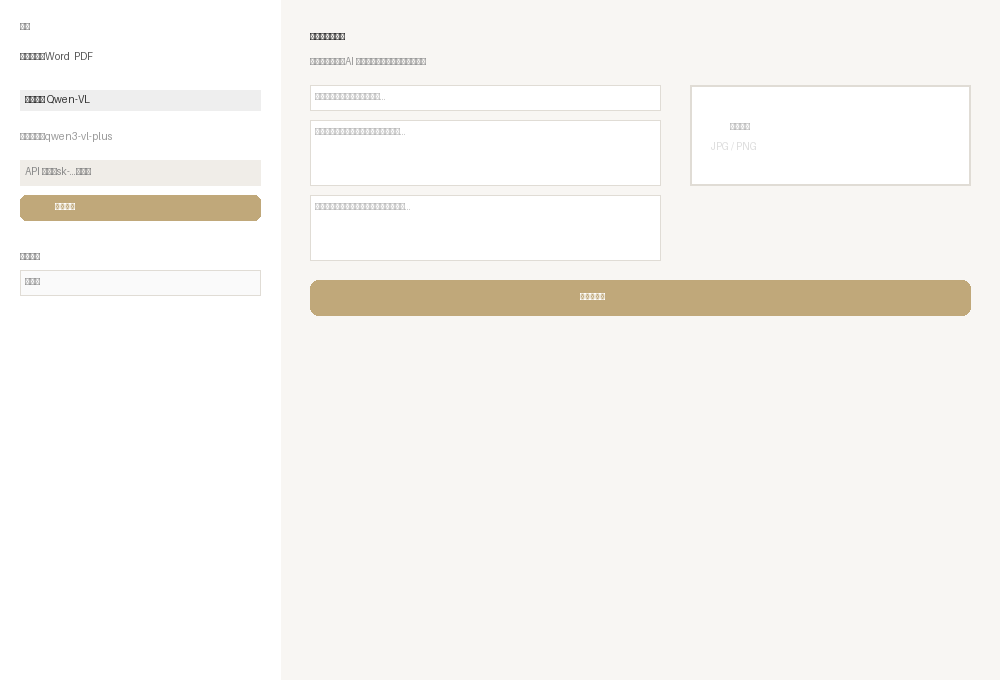

<div align="center">
  <h1>🎨 美术教案生成器</h1>
  <p>上传参考作品图片，AI 自动生成一份排版规范的教案文档</p>
  <p>
    <a href="#-快速开始">快速开始</a> ·
    <a href="#-功能">功能</a> ·
    <a href="#-使用方式">使用方式</a> ·
    <a href="#-项目结构">项目结构</a>
  </p>
</div>

<br />



## 📋 功能

- **AI 自动生成教案** — 支持通义千问、GLM、小米 MiMo、Kimi 等模型
- **图片分析** — AI 自动分析参考作品的构图、色彩、技法并融入教案
- **双格式导出** — Word (.docx) 和 PDF 两种输出格式可选
- **排版规范** — 参照美术教案标准排版（22pt 标题、16pt 小节、12pt 正文）
- **自动识别** — 主题和材料可不填，AI 自动从图片识别
- **记住密钥** — 每个模型的 API 密钥独立本地保存，下次自动填入
- **双模式** — Web 界面和命令行两种交互方式

## 🛠️ 技术栈

| 组件 | 技术 |
|------|------|
| Web 界面 | [Streamlit](https://streamlit.io/) |
| Word 生成 | [python-docx](https://python-docx.readthedocs.io/) |
| PDF 生成 | [fpdf2](https://pyfpdf.github.io/fpdf2/) |
| AI 调用 | [OpenAI SDK](https://github.com/openai/openai-python)（兼容国产模型） |
| 图片处理 | [Pillow](https://python-pillow.org/) |

## 🚀 快速开始

```bash
# 1. 克隆或下载项目
cd lesson_app

# 2. 安装依赖
pip install -r requirements.txt

# 3. 运行
streamlit run app.py
```

浏览器打开 `http://localhost:8501` 即可使用。

## 📖 使用方式

### 网页版

1. 左侧选择 AI 模型 → 填入 API 密钥
2. 上传参考作品图片
3. 填写主题和材料（可不填，AI 自动识别）
4. 点击「生成并下载」

### 命令行版

```bash
python cli.py
```

### 诊断工具

```bash
python diagnose.py
```

### 支持的 AI 模型

| 模型 | 看图 | 免费额度 | 网络 |
|------|:----:|---------|:----:|
| 通义千问 Qwen-VL (阿里云) | ✅ | 新用户 7000 万 tokens | 直连 |
| GLM-5V-Turbo (智谱AI) | ✅ | 新用户有免费额度 | 直连 |
| 小米 MiMo-VL | ✅ | 按量付费 | 直连 |
| Kimi-VL (月之暗面) | ✅ | 按量付费 ¥2/百万tokens | 直连 |

## 📁 项目结构

```
lesson_app/
├── app.py                  # Web 界面
├── cli.py                  # 命令行界面
├── diagnose.py             # 诊断工具
├── requirements.txt
├── pyproject.toml          # 项目配置
├── generator/
│   ├── models.py           # 数据结构
│   ├── template.py         # Word 排版引擎
│   ├── pdf_export.py       # PDF 排版引擎
│   ├── ai_utils.py         # AI 调用与模型配置
│   └── key_store.py        # 本地密钥存储
├── examples/               # 样例输出
│   ├── 迎春花教案样例.docx
│   ├── 迎春花教案样例.pdf
│   └── screenshot.png
└── .streamlit/
    └── config.toml
```

## 📄 输出样例

[examples/迎春花教案样例.docx](examples/迎春花教案样例.docx) · [examples/迎春花教案样例.pdf](examples/迎春花教案样例.pdf)

## ⚙️ 工作原理

```
上传图片 + 填写信息 → AI 模型分析 → 生成 JSON → 排版引擎 → 输出 Word/PDF
```

## 📝 注意事项

- API 密钥仅在当前会话使用，不会上传
- 密钥存储在本地的 `api_keys.json`（已加入 `.gitignore`）
- 首次使用建议开通阿里云百炼免费额度

## 📄 许可证

MIT
